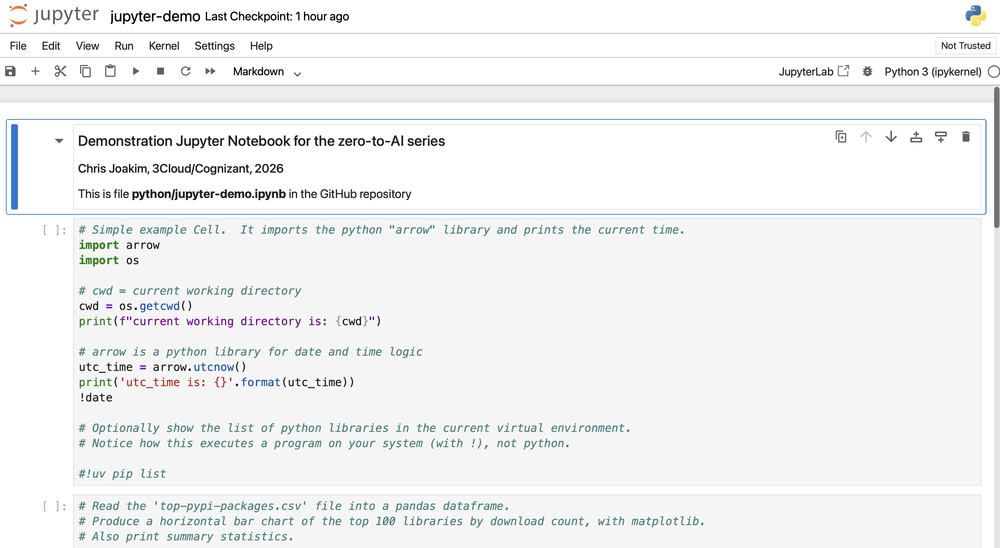
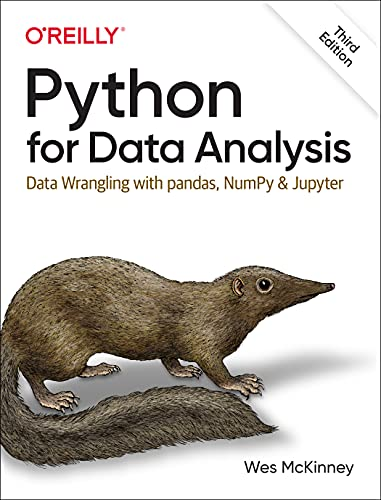

# Part 1, Session 6 - Notebooks, Jupyter, Dataframes, Pandas

## The "Notebook" programming paradigm

- [Jupyter](https://jupyter.org), [Apache Spark](https://spark.apache.org), and [AzureDatabricks](https://azure.microsoft.com/en-us/products/databricks) all use the **Notebook** programming paradigm
  - **You write your code in an interactive web page** with sequential **"cells"**
  - The web page interacts with the Jupyter, Apache Spark, or Databricks back-end server
- The cells can be **documentation** (i.e. - markdown), or **code in one of several languages**
- The cells persist state within your notebook program
  - So you can modify and  rerun a cell and use the data from previous cells
- **Data Scientists** and **Data Engineers** generally like the Notebook programming paradigm
- Other Microsoft Notebook programming environments include:
  - [Azure Machine Learning](https://learn.microsoft.com/en-us/azure/machine-learning/apache-spark-azure-ml-concepts?view=azureml-api-2) also supports Notebooks
  - [Microsoft Fabric](https://learn.microsoft.com/en-us/fabric/data-engineering/spark-compute) also offers Spark

   

## [Jupyter](https://jupyter.org)

- Jupyter is a python library that runs on your workstation that supports Notebooks
- Jupyter is a  **"Learning Gateway to Spark and Databricks"**, IMO
- Spark and Databricks are similar, but run in the cloud at scale on large datasets with parallel processing

#### Jupyter in a Browser

   

#### Jupyter in Cursor

   

   

## [Dataframes](https://learn.microsoft.com/en-us/azure/databricks/getting-started/dataframes)

- Are the typical data structure in Spark
- Somewhat like an in-memory Excel file - rows and columns
- Spark has many simple and powerful ways to manipulate dataframes

   

## [PySpark](https://spark.apache.org/docs/latest/api/python/index.html)

  - Python + Spark = **PySpark**
  - [Dataframe](https://spark.apache.org/docs/latest/sql-programming-guide.html) manipulation functionality is built into Spark
  - Spark can access many data sources, including:
    - [CSV](https://spark.apache.org/docs/latest/api/python/reference/api/pyspark.sql.DataFrameReader.csv.html)
    - [JSON](https://spark.apache.org/docs/latest/api/python/reference/api/pyspark.sql.DataFrameReader.json.html)
    - [Parquet](https://spark.apache.org/docs/latest/api/python/reference/api/pyspark.sql.DataFrameReader.parquet.html)
    - [Avro](https://spark.apache.org/docs/latest/api/python/reference/api/pyspark.sql.DataFrameReader.avro.html)
    - [ORC](https://spark.apache.org/docs/latest/api/python/reference/api/pyspark.sql.DataFrameReader.orc.html)
    - [Delta](https://spark.apache.org/docs/latest/api/python/reference/api/pyspark.sql.DataFrameReader.delta.html)
    - [Iceberg](https://spark.apache.org/docs/latest/api/python/reference/api/pyspark.sql.DataFrameReader.iceberg.html)

   

## [Pandas](https://pandas.pydata.org)

- **Pandas** is a Python library that also implements **dataframes**
- But pandas is typically used on a laptop or VM, not in Spark
- Same concepts, and similar syntax
- [Getting Started](https://pandas.pydata.org/getting_started.html)
- The combination of **Jupyter and pandas** is similar to **Spark and Databricks**
- Thus, your knowledge in Jupyter/pandas can easily transition to Spark and Databricks

   

## Pro Tip - Excellent O'Reilly book

- Python for Data Analysis: Data Wrangling with pandas, NumPy, and Jupyter
- By Wes McKinney, the creator of pandas in 2008
- See https://wesmckinney.com/book/

   

   

## Demonstration - Data Wrangling with Jypyter, pandas, and duckdb

See file **python/jupyter-demo.ipynb** in this repo for a demonstration.

   

## Links

- [Jupyter](https://jupyter.org)
- [Pandas](https://pandas.pydata.org)
- [Apache Spark](https://spark.apache.org) is a data analytics platform
- [Databricks](https://www.databricks.com) is an excellent commercial version of Spark
- [Microsoft Fabric](https://learn.microsoft.com/en-us/fabric/data-engineering/spark-compute) also offers Spark
