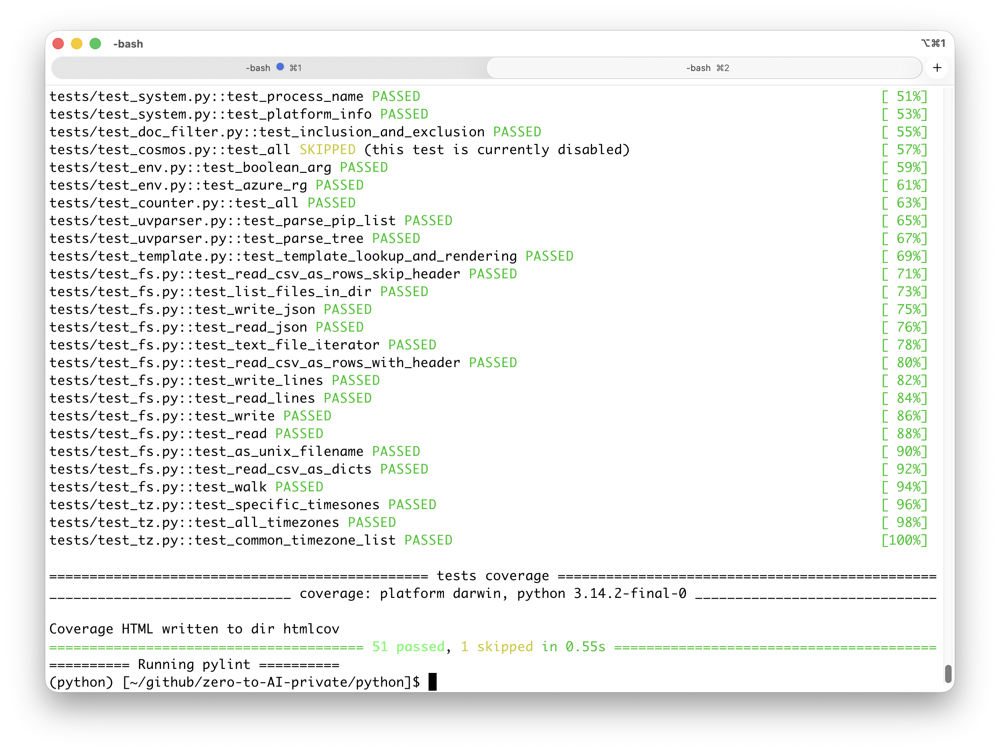
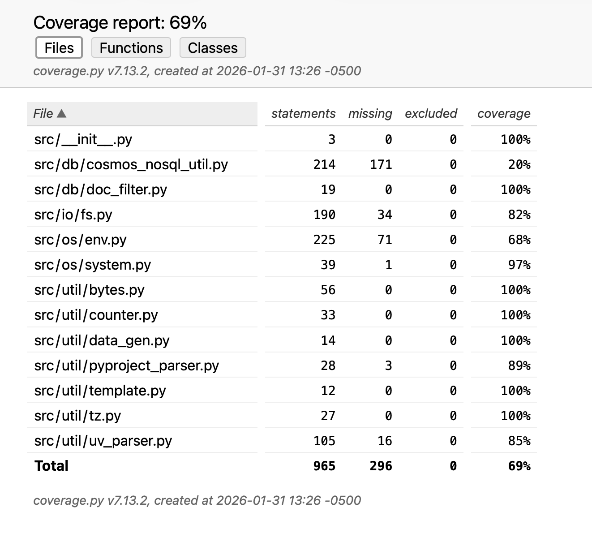
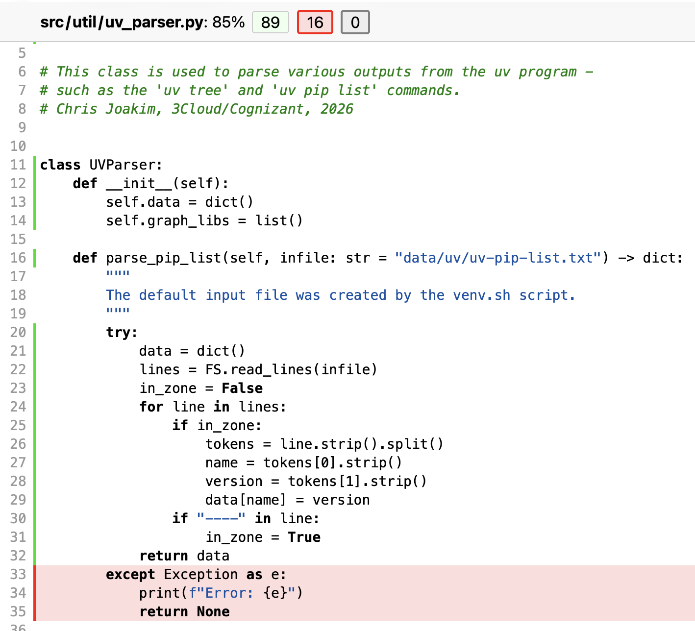

# Part 1, Session 7 - Unit Testing, CI/CD. and Python Datatypes

<br><br><br>

## How do you know that your code works?

- You can run it manually and visually inspect the results
  - **This doesn't scale**
  - Humans get bored, tired, and make mistakes with repetitious tasks like this

- **It's much better to execute tests of your code in an automated and repeatable manner**
  - Why? 
  - Because it's faster
  - Because it's more accurate
  - Because it improves the quality of your application
  - You can do something else while the tests are running

<br><br><br>

## Pytest

[pytest](https://docs.pytest.org/en/stable/) is the most common Python unit-testing framework

But, before we get to pytest, let's first understand some important concepts about Python datatypes...

<br><br><br>

## The Rainbow of Programming Languages

### Static/Typed/Compiled Programming Languages

- Compiled
  - The compiler is a software tool that:
    - Checks the code syntax at **Development time** (i.e. - before deployment)
    - Converts the text source code into a compiled binary format that is executable
    - Produces a boolean result - it compiles successfully or it doesn't
  - Example Programming Languages: Java, C, Rust
  - Each variable name is associated with a specific datatype (int, String, array, etc)

#### Java Example

```
int x = 10;        # the integer variable x is assigned the value 10
x = "eleven";      # <-- compile error; x must be an int, not a String
```

**The compiler does a lot of work for you, and helps you catch errors at development time.**

However, it **doesn't** guarantee that the code will work correctly,
but it will catch syntax errors at development time.

### Dynamic/Untyped Programming Languages

- They are "compiled" at **Runtime** (i.e. - AFTER deployment) from text code
- Example Programming Languages: JavaScript, Ruby, Python

#### Python Example 1

```
x = 10             # the variable x is assigned the value 10.  x isn't typed
x = "eleven"       # This is Ok, no compile error, x can be any value!
```

#### Python Example 2

```
x : int = 10       # the ': int' part is a type hint.  It helps the IDE, but Python ignores it.
x = "eleven"       # This is Ok, no compile error, x can be any type of value

pi : float = 3.14159

msg : str = "Hello, World!"

# lists of things

cities : list[str] = ["New York", "London", "Tokyo"]

towns = list()
towns.append("Charlotte")
towns.append("Raleigh")

# dictionaries of key-value pairs

person : dict[str, int] = {"name": "John", "age": 30}

days = dict()
days["Monday"] = 1
days["Tuesday"] = 2
days["Wednesday"] = 3
days["Thursday"] = 4
days["Friday"] = 5
days["Saturday"] = 6
days["Sunday"] = 7
```

**Dynamic languages like Python require more testing diligence due to their dynamic and untyped nature**

<br><br><br>

## Wait, what do you mean by **types**?

- "Types" are the **datatypes** for a variable implemented in the programming language
- Different programming languages have different datatypes, but they are generally similar

### Primary Python Datatypes

Compared to other programming languages, Python has a very few primary datatypes.

This makes Python a relatively easy language to learn and use.

**I recommend that you spend some time to learn about these datatypes.**

- **str** (string), text values
- **int** (integer)
- **float** (floating point number)
- **dict** (dictionary, a set of key-value pairs)
- **list** (an array of sequential values)
- **tuple** (also an array of sequential values)
- **set** (a set of unique values)
- **None** (no value, like null in other languages)

### You can also define your own types, called Classes

Classes are used to implement custom logic.

This is called **object-oriented programming** (OOP).

#### Defining a Class

```
class Person:
    def __init__(self, name, age):   # this is the constructor method
        self.name = name
        self.age = age

    def say_hello(self):
        print(f"Hello, my name is {self.name} and I am {self.age} years old")
```

#### Using class Person:

```
p = Person("Maria", 30)      # call the constructor method
p.say_hello()                # call the say_hello method
```

#### Classes defined in this repo

- **FS** (File System), in file **python/src/io/fs.py**
- **CosmosNoSqlUtil** (Azure Cosmos DB NoSQL), in file **python/src/db/cosmos_nosql_util.py**
- **Env** (Environment Variables), in file **python/src/os/env.py**
- **StorageUtil** (Azure Blob Storage), in file **python/src/io/storage_util.py**
- **Bytes** (mb, tb, pb, eb translation), in file **python/src/util/bytes.py**
- And several more ...

<br><br><br>

## Pytest

- [pytest](https://docs.pytest.org/en/stable/) is the most common Python unit-testing framework
- The idea is to invoke your implementation code from separate unit-test code 
- Exexute methods on the classes/methods in your code
- Then make **assertions** about the results
- You can optionally use standard input data, called **fixtures**
- **pytest produces a report showing whas passed and what failed**
- You can also optionally use **code coverage** to see what code was tested and which wasn't

### How to Structure your Implementation and Unit-Test Code

Keep the implementation code and the unit-test code in separate 
files and directories.  For example:

```
python/src/io/fs.py          <-- Implementation Code

python/tests/test_fs.py      <-- Corresponding Unit-test Code
```


### But, will it slow down development to write the tests?

- IMO, no, because you will find the bugs/errors immediately.  Easier to fix.
- You can proceed confidently, knowing that your code works as expected
- Should I test 100% of my code?
  - Generally no, an 80/20 rule is practical and sufficient
- **I recommend that you use pytest for all of your Python projects, even small ones**


### Example Unit Test 

This example is in test file **python/tests/test_fs.py**.
It tests class FS which is defined in file **python/src/io/fs.py**

```
def test_read():
    s = FS.read("tests/fixtures/nc_zipcodes.json")
    assert len(s) == 304618

    s = FS.read("tests/NOTFOUND/nc_zipcodes.json")
    assert s is None
```

### Executing the unit test suite in this repo

This will execute of the tests in the **/tests** directory.

The filenames must start with **test_** and the test functions must start with **test_**

```
tests.ps1                   # on Windows, in PowerShell
tests.sh                    # on Linux/Mac, with bash shell

- or - 

pytest -v tests/test_fs.py  # execute the unit test for just the fs module
```

TODO - capture a screenshot of the pytest test results

<p align="center">
   
</p>

<br><br><br>

## What exactly got tested?

- You'll want to know what parts of your code were tested, and which weren't
- Code coverage
- pytest-cov library
- Run the tests script, then open file htmlcov/index.html in your browser

### Code Coverage Summary Report 

<p align="center">
   
</p>

### Code Coverage Details for one Module

<p align="center">
   
</p>

<br><br><br>

## Pro Tip: Use the coverage report to guide you in writing additional tests

- Find the shaded and currently untested parts of your code in the details report
- Strive to make your code more testable
- Smaller methods with few lines of code
- Test that your code works with expected inputs
- But also test that your code fails properly with incorrect inputs
  - For example, return the month name for months 1..12.  But also -3, 0, and 13.
- **Test Infection** - when testing becomes fun, and you know it's good for you

<br><br><br>

## Another Pro Tip: Use pylint to check your code for errors

[pylint](https://pylint.pycqa.org/en/latest/) is a **great** code-checking tool
that helps you find errors in your code.

It's almost as good as a compiler in a language like Java or C++.

#### Executing pylint

This is at the bottom of the **tests.ps1** and **tests.sh** scripts.

```
pylint --errors-only *.py src
```

<br><br><br>

## Professional applications use CI/CD pipelines 

- CI = Continuous Integration
- CD = Continuous Deployment (or Delivery)

### Common CI/CD Environments 

- [GitHub Actions](https://github.com/features/actions)
- [Azure DevOps](https://azure.microsoft.com/en-us/products/devops)

See the **GitHub Actions** for this repository -
file **.github/workflows/python_lint_and_test.yml**

### Pipeline Example 

- Triggered by some event, such as a pull request (PR)
- It runs in the CI/CD cloud environment - Azure DevOps, GitHub Actions, etc
- Clone the code from the git repository 
- Create the venv and install libraries
- **Execute unit tests (i.e. - with pytest)**
- **Execute code-checking (i.e. - with pylint)**
- **If** all tests pass, then execute additional steps:
  - Build a Docker container
  - Push the Docker container to a container registry such as Azure Container Registry (ACR)

#### Additionally, the pipeline can:

- Deploy the application with Terraform, ARM, Bicep, etc


<br><br><br>
---
<br><br><br>

[Home](../README.md)
